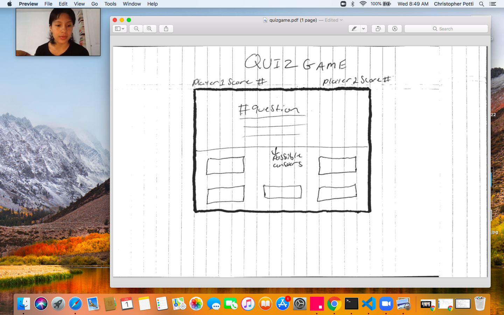

#game-proposal

##rules

* _1_.players will take turns answering a series of trivia questions 
* _2_.players will get one chance to answer each question correctly
* _3_.each question answered correctly is 1 pt
* _4_. first player to  reach 5 pts wins
* _5_ each game will const of two rounds with different catagories 

##challenges
* getting infomation
* planing out the game rounds
* seperating the game rounds with out ending the game 
* getting the correct information to display
* getting the computer to know when the player has chosen the correct answer
* getting the players points to show on screen
* getting the game to end 
* getting my css to look profesional and inline with my vision     

##wire frame  
       

#time line 
###_tuesday_ 
* wireframe 
* project proposal

###_wednesday_ 
* pseudo code 
* get trivia questions 
* start code html /css/ javascript boiler plates,
* create objects/ arrays
* enter information 
* make first commits

###_thursday_
* continue to code 
* build on previous day 
* make commits each step of the way 

###_friday_
* continue to code
* assess what road blocks i have hit and  request help if needed before weeknd 

###_saturday_
* finish javascript if not finished already
* start on css

###_sunday_
* complete project 
* review project code make sure it works
* make sure comments are in place
##_make sure minimum Viable product requirments are all met_

###possible streach goals

* setting timers for questions 
* getting questions to populate randomly
* making sure no two players get the same questions 
* css animations when players select the wrong answer
* css animations when players click the right answer 
